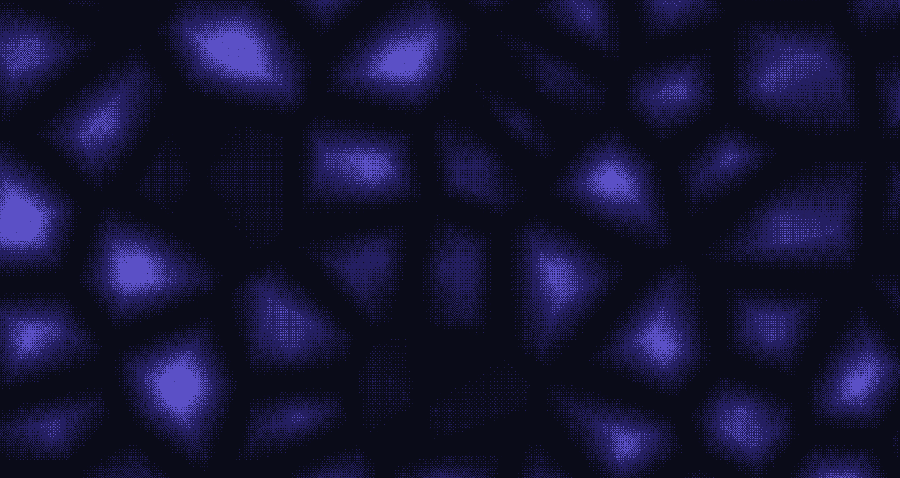
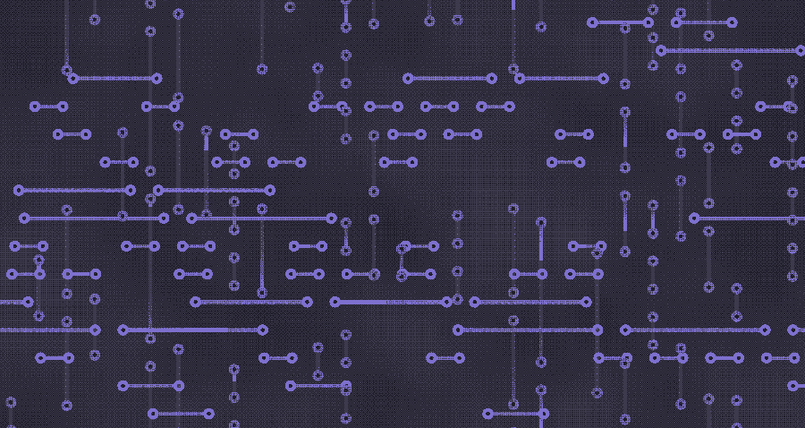

# Pixeldish

Dithered procedural wallpapers for macOS. A small native menu bar app written
in Swift and Metal. It has no dock icon and no dependencies.

<p>
  
  
</p>

## Features

- 15 shape generators: flow, mesh, plasma, ripple, aurora, cells, topo, whorl,
  sonar, mosh, weave, belts, circuit, julia, kali
- 10 dither algorithms
- 20 palettes (Dracula Pro, Van Helsing, Catppuccin Mocha/Latte, Nord, Gruvbox,
  Tokyo Night, Rose Pine and more), plus one built from any photo
- live animated desktop layer on every display, or a still frame
- use a photo as the source image
- export a PNG for each display
- saved looks, history, launch at login

Each shuffle or reseed takes a new seed from the clock. The seed changes more
than the noise offset: it also picks scale, spiral direction and drift.

## Install

Grab the dmg from [Releases](../../releases) and drag Pixeldish to
Applications. The build is ad-hoc signed and not notarized, so the first launch
needs right-click, then Open.

Or build it yourself (below) and run `just install`.

## Usage

Click the grid icon in the menu bar:

| item | key |
|---|---|
| Editor | ⌘E |
| Shuffle | ⌘R |
| Previous | ⌘P |
| Save look | ⌘S |
| Quit | ⌘Q |

The editor has every knob: shape, dither, palette, colour count, pixel size,
warp, contrast, grain, vignette, zoom, spread, speed, invert and animate.

## Building

Needs macOS 14+, the Xcode Command Line Tools and [`just`](https://github.com/casey/just).

```sh
just build      # build/Pixeldish.app
just install    # icon + build, copy to /Applications
just run        # install, then launch
just test       # selftest + palette/dither audit
just audit      # palette/dither audit only
just test-live  # check the live desktop window actually draws
just sheet      # build/contact-sheet.png with every shape x dither
just dmg        # build/Pixeldish-<version>.dmg
just uninstall  # remove the app and its prefs
```

`nix develop` gives a shell with `just` and pinned `swiftformat` and
`swiftlint` for `just fmt` and `just lint`.

The shader gets compiled at launch, not at build time, because the Command Line
Tools come without a `metal` compiler. It ships as
`Contents/Resources/shader.metal`.

## Layout

| path | what |
|---|---|
| `src/main.swift` | entry point: CLI modes, then the app |
| `src/app/` | menu bar, editor, wallpaper windows, prefs |
| `src/render/` | shader, renderer, palettes, ASCII atlas |
| `src/checks/` | selftest, built into the app |
| `dev/` | dev-only checks, not shipped (palette/dither audit) |
| `tools/make-icon.swift` | generates the app icon |

## Tests

`--selftest`, `--sheet` and `--capture <path> [w h]` are modes of the app
binary. The audit lives in `dev/` and `just audit` builds it against the same
renderer into a separate binary, so it never ships but cannot drift either.
New dev-only checks go in `dev/` the same way.

Each dither maps the field onto the palette. So anything that darkens or
roughens the image has to change the field first. If you change the colour
afterwards, you get colours that aren't in the palette, and they look like
noise. The audit checks that, plus:

- palette ramps go up in luminance, and no step is too small to dither or big
  enough to blotch
- no dither puts out a colour that isn't in the palette (`smooth` is the one
  exception, it is the plain gradient)
- each dither reaches every palette level the shape covers
- a 2-colour render has exactly 2 colours
- N colours span the whole palette, not just its N darkest entries
- adjacent saturated entries are at most 90° apart in hue, so the dither does
  not shimmer
- `spread` really does widen a narrow shape's range

## Contributing

Issues and PRs are welcome. Run `just lint` and `just test` before you open a PR.

## License

MIT, see [LICENSE](LICENSE).
